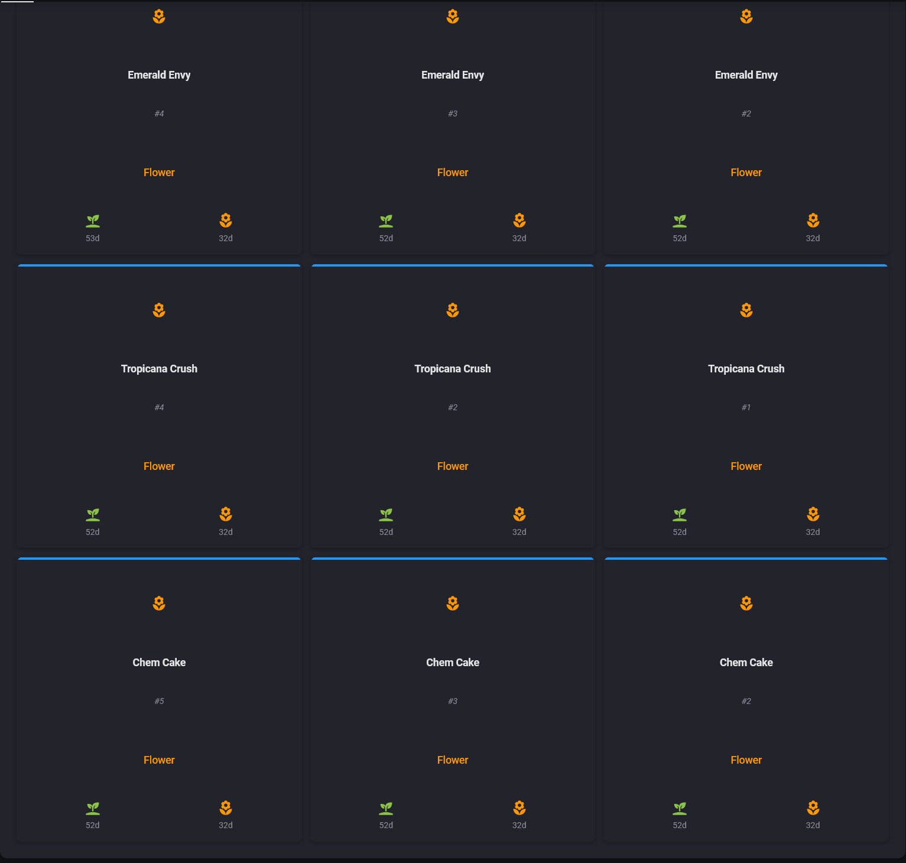

# Growspace Manager

**Growspace Manager** is a comprehensive Home Assistant integration for meticulously managing cannabis cultivation environments. It provides a powerful and intuitive way to track plants, organize growspace layouts, monitor environmental conditions, and receive intelligent notifications to ensure your plants thrive.

## Features

*   **Detailed Plant Tracking**: Monitor individual plants from seed to cure, tracking their strain, phenotype, position, and key dates (veg, flower, etc.).
*   **Visual Growspace Layouts**: Organize your plants in a grid system for each growspace. Visualize your entire setup at a glance using the companion Lovelace card.
*   **AI Assistant**: Built-in AI integration (powered by Home Assistant's conversation agents) provides:
    *   **Diagnostics**: Analyze sensor data to identify issues like heat stress or VPD imbalances.
    *   **Optimization**: Get tailored advice on how to improve your environment for the specific growth stage.
    *   **Planning**: Ask for help with scheduling, training techniques, or harvest timing.
*   **Advanced Environmental Monitoring**: Utilizes a sophisticated Bayesian inference engine to provide intelligent binary sensors for:
    *   **Plant Stress**: Detects when conditions like temperature, humidity, or VPD are likely causing stress to your plants.
    *   **Mold Risk**: Proactively warns you of conditions favorable to mold growth, especially during the critical late-flowering stage.
    *   **Optimal Conditions**: Confirms when your environmental parameters are within the ideal range for the current growth stage.
    *   **Light-Aware Logic**: Uses an optional light sensor to apply more accurate day/night thresholds and verifies your light schedule is correct for the plant's growth stage.
*   **Strain Analytics**: Automatically tracks harvest data to provide average veg and flower times for each strain.
*   **Task Calendar**: Generates a dedicated calendar for each growspace with scheduled tasks based on your timed notifications.
*   **Dynamic Entity Creation**: Automatically generates a rich set of sensors and controls for each growspace and plant.
*   **Notification Control**: Easily toggle notifications for each growspace with a dedicated switch.
*   **Strain Library**: Automatically catalogs all your unique strains for easy reference.
*   **Specialized Growspaces**: Comes with pre-configured logical spaces for managing clones, mothers, drying, and curing.

## Advanced Features

### Strain Analytics
The `StrainLibrarySensor` does more than just list your strains; it automatically compiles harvest data to provide valuable insights. When a plant is moved to the "dry" growspace, its veg and flower durations are recorded. The sensor then calculates and exposes the average veg and flower times for each strain and phenotype, allowing you to refine your cultivation cycles and compare results over time.

### Task Calendar
For each growspace, the integration now creates a dedicated Home Assistant calendar entity. This calendar is automatically populated with tasks and reminders based on the timed notifications you configure. For example, if you set a reminder to "Check trichomes" on day 60 of flower, a corresponding all-day event will appear on the calendar, ensuring you never miss a critical task.

### Light-Aware Monitoring
By configuring an optional light sensor for your growspace, you unlock more intelligent environmental monitoring:
*   **Day/Night Logic**: The Bayesian sensors will automatically switch between day and night thresholds for temperature and VPD, leading to more accurate stress and mold risk detection.
*   **Schedule Verification**: A `LightCycleVerificationSensor` is created to monitor your light's on/off cycles. It verifies that the light is running for the correct duration for the current growth stage (e.g., 18/6 for veg, 12/12 for flower) and will turn off if the schedule is incorrect, alerting you to potential timer malfunctions.

## Installation

This integration requires two components: the main integration (installed via HACS) and the Lovelace card (also installed via HACS).

**Step 1: Install the Lovelace Card**
1.  Navigate to **HACS** > **Frontend**.
2.  Click the three dots in the top right and select **Custom repositories**.
3.  Enter the repository URL: `https://github.com/Venosta-web/lovelace-growspace-manager-card` and select the category **Lovelace**.
4.  Click **Add**.
5.  Find the "Growspace Manager Card" in the list and click **Install**.

**Step 2: Install the Growspace Manager Integration**
1.  Navigate to **HACS** > **Integrations**.
2.  Click the three dots in the top right and select **Custom repositories**.
3.  Enter the repository URL: `https://github.com/Venosta-web/growspace_manager` and select the category **Integration**.
4.  Click **Add**.
5.  Find "Growspace Manager" in the list and click **Install**.
6.  Restart Home Assistant when prompted.

## Configuration: A Step-by-Step Guide

### Step 1: Add the Growspace Manager Integration
1.  Go to **Settings** > **Devices & Services**.
2.  Click **+ Add Integration** and search for **Growspace Manager**.
3.  Follow the initial prompt to add the integration.

### Step 2: Create Your First Growspace
The integration is managed through its configuration menu.
1.  On the integration's card, click **Configure**.
2.  You will see three options: "Manage Growspaces", "Manage Plants", and "Configure Environment Sensors". Select **Manage Growspaces** and click **Submit**.
3.  For the "Action", select **Add Growspace**.
4.  Fill in the details for your growspace:
    *   **Name**: e.g., "4x4 Tent"
    *   **Rows**: The number of plant rows.
    *   **Plants Per Row**: The number of plants in each row.
    *   **Notification Target**: (Optional) The notification service you want to use (e.g., `mobile_app_your_phone_name`).
5.  Click **Submit**.

### Step 3: Add Your First Plant
1.  Go back to the integration's **Configure** menu.
2.  Select **Manage Plants** and click **Submit**.
3.  For the "Action", select **Add New Plant** and click **Submit**.
4.  First, select the growspace you just created from the dropdown and click **Submit**.
5.  Now, fill in your plant's details:
    *   **Strain**: The name of the strain.
    *   **Row / Col**: The position in the grid.
    *   **Veg Start / Flower Start**: Set the date when the stage began.
6.  Click **Submit**.

### Step 4: Configure Environment Sensors
This is where the magic happens. By linking your existing sensors, you enable the intelligent Bayesian monitoring.
1.  Go back to the integration's **Configure** menu.
2.  Select **Configure Environment Sensors** and click **Submit**.
3.  Select the growspace you want to configure and click **Submit**.
4.  Link your sensor entities:
    *   **Required**: Temperature, Humidity, and VPD sensors.
*   **Optional**: A light or switch to determine if the lights are on/off, a CO2 sensor, and a circulation fan switch. Linking a light sensor enables more accurate day/night logic and activates the `LightCycleVerificationSensor`.
5.  Click **Submit** to save. The Bayesian binary sensors will be created automatically.

### Step 5: Configure AI Assistant (Optional)
Unlock intelligent insights by connecting a conversation agent.
1.  Go back to the integration's **Configure** menu.
2.  Select **Configure AI Assistant** and click **Submit**.
3.  **Enable AI Assistant**: Toggle this on.
4.  **Select Assistant**: Choose your preferred conversation agent (e.g., OpenAI, Google Generative AI, or a local LLM).
5.  **Personality**: Choose a personality style (e.g., "Professional", "Friendly", "Scientist").
6.  **Max Response Length**: Set a limit for the advice length to keep it concise.
7.  Click **Submit**.

### Step 6: Add the Card to Your Dashboard
1.  Navigate to the dashboard where you want to display your growspace.
2.  Click the three dots in the top right and select **Edit Dashboard**.
3.  Click **+ Add Card** and search for the **Custom: Growspace Card**.
4.  Select the **Growspace Overview Sensor** that corresponds to the growspace you created (e.g., `sensor.4x4_tent`).
5.  Click **Save**.

Your dashboard should now display a visual grid of your growspace!

## Entities Created
This integration will create the following entities for you:

*   **Growspace Overview Sensor**: (`sensor.<growspace_name>`) The primary sensor for a growspace. Its state is the number of plants, and its attributes contain the grid layout and stage information. This is the entity you use with the Lovelace card.
*   **Plant Sensor**: (`sensor.<plant_strain>_<row>_<col>`) A detailed sensor for each individual plant. Its state is the current growth stage (e.g., "veg", "flower").
*   **Notification Switch**: (`switch.<growspace_name>_notifications`) Allows you to enable or disable notifications for a specific growspace.
*   **Strain Library Sensor**: (`sensor.growspace_strain_library`) A sensor whose state is the number of unique strains and whose attributes contain detailed harvest analytics, including average veg/flower times.
*   **Growspaces List Sensor**: (`sensor.growspaces_list`) A sensor whose attributes contain a list of all your configured growspaces.
*   **Task Calendar**: (`calendar.<growspace_name>_tasks`) A calendar entity for each growspace that displays scheduled tasks based on your timed notifications.

### Services
The integration exposes the following services:

*   **`growspace_manager.ask_grow_advice`**: Ask the AI assistant for advice on a specific growspace.
    *   **Targets**: A growspace overview sensor (e.g., `sensor.4x4_tent`).
    *   **Fields**:
        *   `user_query` (Optional): A specific question to ask. If omitted, the AI provides a general status update.
        *   `context_type`: The type of advice needed (`general`, `diagnostic`, `optimization`, `planning`).
        *   `max_length`: Maximum length of the response.

### Environmental Monitoring Sensors
When you configure environmental sensors for a growspace, the following powerful binary sensors are created:

*   **Plants Under Stress**: (`binary_sensor.<growspace_name>_plants_under_stress`) This sensor turns **ON** when the combination of temperature, humidity, VPD, and other factors indicates a high probability of plant stress. This is your primary indicator that something in the environment needs attention.
*   **High Mold Risk**: (`binary_sensor.<growspace_name>_high_mold_risk`) This sensor turns **ON** when conditions are favorable for mold and bud rot, particularly during the lights-off period in late flower. It monitors for high humidity, low VPD, and poor air circulation.
*   **Optimal Conditions**: (`binary_sensor.<growspace_name>_optimal_conditions`) This sensor turns **ON** when your environment is perfectly dialed in for the current growth stage. When this sensor is on, you know your plants are happy. It turns **OFF** as a warning that conditions have drifted out of the ideal range.
*   **Light Schedule Correct**: (`binary_sensor.<growspace_name>_light_schedule_correct`) An optional sensor (created when a light entity is configured) that turns **ON** if the light's on/off cycle duration is correct for the current growth stage.
