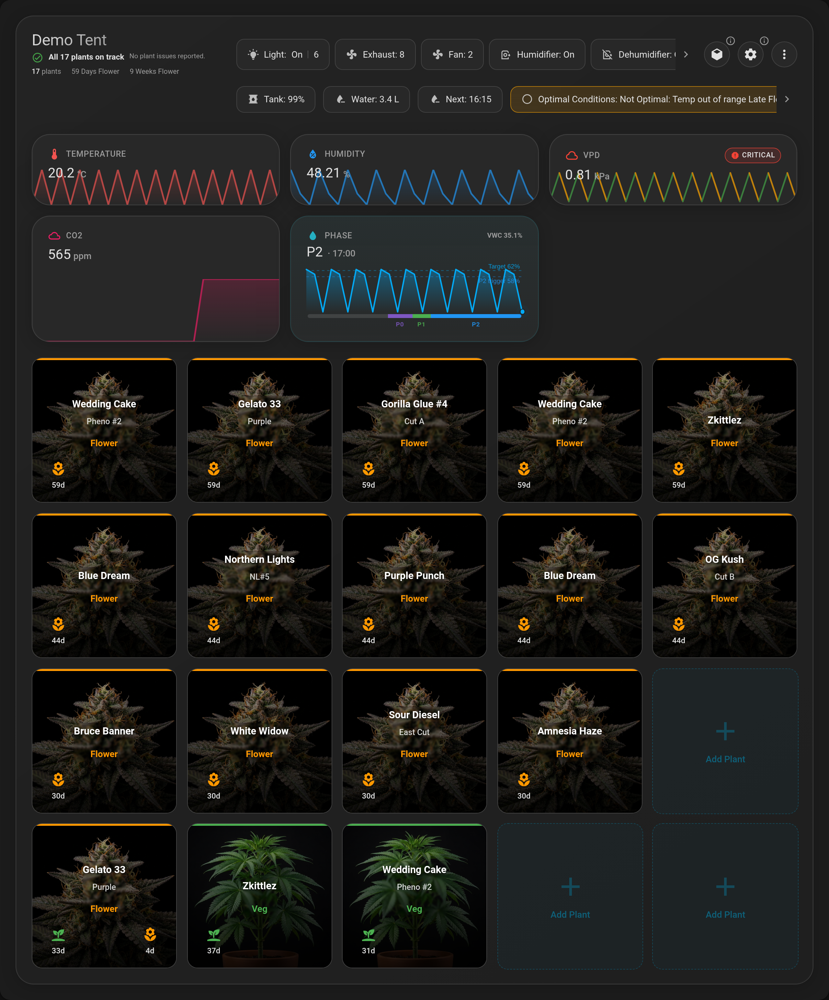
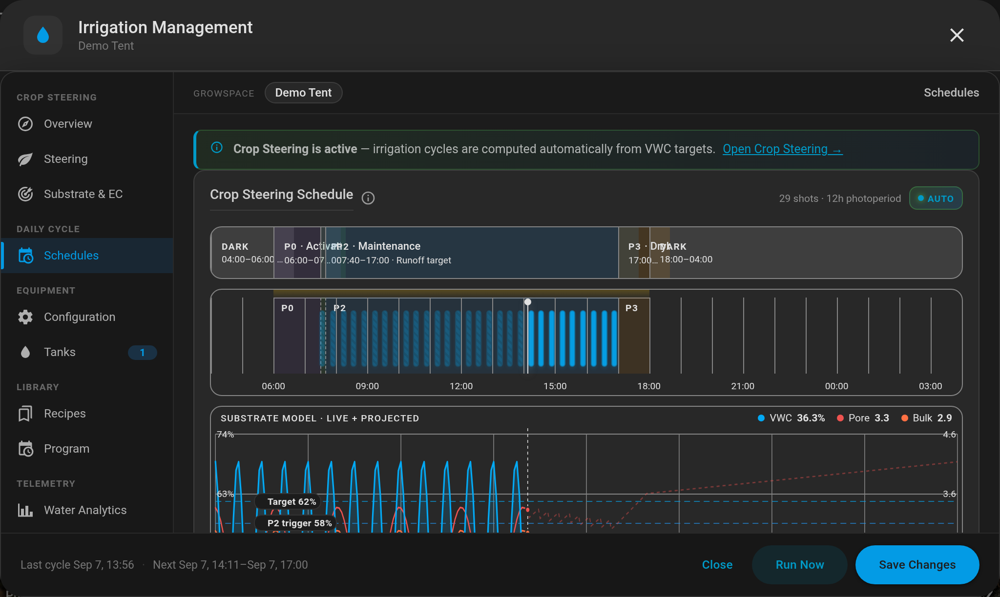
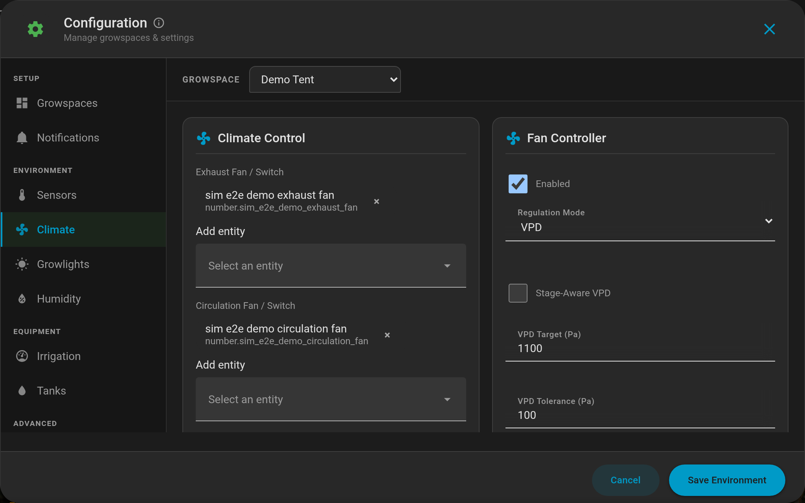
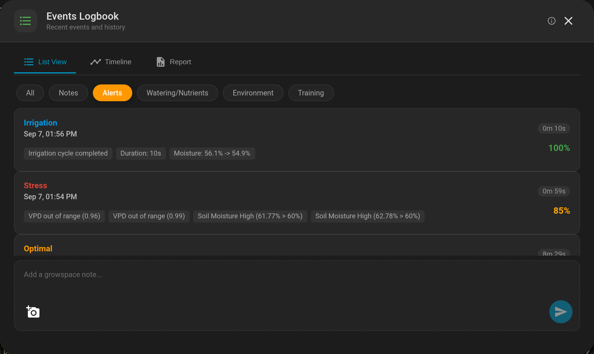
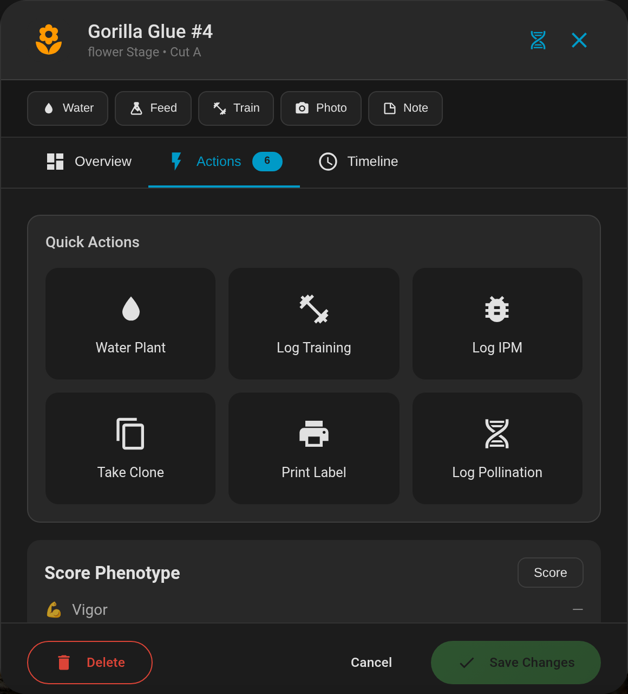

# Growspace Manager

[](https://github.com/hacs/integration)
[](https://github.com/Venosta-web/growspace_manager/releases/latest)
[](LICENSE)

**Growspace Manager** is an open-source cultivation management system for Home
Assistant: plant tracking from seed to cure, environmental automation,
irrigation and crop steering, genetics, and harvest history.

Automation is opt-in. Nothing moves water until you arm irrigation on a
growspace, and the climate controllers only drive devices you bind to them.
Before you let it run unattended, read
**[Safety and limitations](#safety-and-limitations)** for what it does when a
sensor, a relay or Home Assistant itself fails, and what it cannot do. Then fit
the **[hardware fail-safes](docs/HARDWARE.md)** and work through the
**[commissioning guide](docs/COMMISSIONING.md)** on your own equipment. The
**[feature matrix](docs/FEATURE_MATRIX.md)** records how each feature has been
verified: by automated tests, on a simulated instance, or on physical hardware.
[HARDWARE.md](docs/HARDWARE.md#supported-and-tested-devices) lists the devices
that have been tested.

It comes in two parts: this integration holds the data and runs the
automation, and the
[Lovelace card](https://github.com/Venosta-web/lovelace-growspace-manager-card)
is its interface. Install the integration first, then the card
([Installation](#installation)).


_A growspace as the integration keeps it: seventeen plants, each one a Home
Assistant entity carrying its own stage and day count, above sensor histories,
a VPD verdict and the crop-steering phase the integration computed from them._

---

## Core Features

- 🌱 **Detailed Plant Tracking**: Register and track individual plants through their lifecycle stages: `seedling → clone → mother → veg → flower → dry → cure`.
- 📐 **Visual Grid Layouts**: Arrange your plants in physical rows and columns inside logical growspaces.
- 💧 **Smart Irrigation & Crop Steering**: Configure vegetative or generative steering profiles (VWC targets, drybacks, shot frequencies) using substrate sensors, or save a proven setup as a reusable Irrigation Recipe and plan a whole run with Irrigation Programs.
- ❄️ **Adaptive VPD Control**: Automate dehumidification and HVAC devices to dynamically steer Vapor Pressure Deficit targets based on plant stage and day/night light cycles.
- 🧠 **Bayesian Environmental Analytics**: Probabilistically assess and report plant stress levels, mold risks, and schedule drift before physical symptoms appear.
- 🧬 **Genetics & Breeding Log**: Catalog strain lineages, parental crosses, seed inventories, and evaluate/score phenotypes to preserve keeper mother plants.
- 📦 **Post-Harvest Analytics**: Track daily weight decay curves and stem-moisture levels during drying to pinpoint optimal cure windows.
- 🏷️ **Label Templates**: Design your own Niimbot label layouts, calibrate each printer, and print single labels or whole batches over Bluetooth. Physically verified on the Niimbot B1 with 50×30 labels.
- 📷 **Growspace Vision**: Camera checkups compare each capture with the plant's own history and alert when the camera stops giving usable evidence. The comparison runs in the separate Growspace Vision App.
- 💬 **Optional AI Grow Master**: Integrate standard Home Assistant Conversation Agents for briefings and a context-aware Virtual Grow Master chat. Advisory only; see [Safety and limitations](#safety-and-limitations).

---

## Safety and limitations

Growspace Manager can switch pumps, humidifiers, dehumidifiers, fans and lights.
This section says what it does when something goes wrong, and what it cannot
do. The irrigation and climate safety behaviour below ships in **1.2.4**, and
is in the `v1.2.4b` betas now. **1.2.3 and earlier have none of it.** The
[feature matrix](docs/FEATURE_MATRIX.md) gives the release each part arrived in
and how it has been verified.

**How far it has been verified.** Automated tests cover all of the behaviour
below. It has **not** yet been commissioned on physical irrigation hardware. The
one simulated commissioning run (2026-09-24) predates most of this work and has
not been repeated since. Treat unattended irrigation as something you
commission yourself.

### Controls

Each growspace has:

- an **Automation** switch (on by default). While it is off, Growspace
  Manager sends that growspace no automatic commands;
- an **Irrigation armed** switch. It is off on a new growspace. A growspace
  that already had pumps before 1.2.4 stays armed, and Home Assistant raises a
  Repairs issue asking you to review it;
- an **Emergency stop** button (also the `emergency_stop` service). It latches,
  commands every managed output to its safe state, and survives a restart. An
  administrator clears it with `reset_safety` once every output reads safe;
- `set_override`, which hands one subsystem to a person for up to 24 hours.
  Growspace Manager sends that subsystem no command at all until the override
  expires or is cleared;
- an **Irrigation Controller** sensor, which shows `ready`, `running`,
  `inhibited`, `fault` or `emergency_stop` and the reason.

### When a sensor fails

- **Substrate moisture.** Shots stop at once when the reading is unavailable,
  stale or out of range. One alert follows after 15 minutes. "Stale" means no
  report for three of the sensor's usual reporting intervals, and never longer
  than 30 minutes. A reading of 0 % counts as valid, because a truly dry pot
  reads 0. Set `moisture_zero_is_implausible` if your probe reads 0 in air.
- **Tank level.** A tank is unknown when its reading is unavailable, has not
  reported for 120 minutes, or is outside 0–100 %. After 10 minutes of that,
  every cycle is refused and one alert goes out. This applies while
  `pause_on_low_tank` is on, which is the default.
- **Climate.** A short sensor loss holds each device's last command. After 10
  minutes with no usable input, a controller goes to its safe state:
  - the humidifier and dehumidifier switch off (configurable);
  - the exhaust runs at a fallback speed (50 % by default);
  - circulation holds.

  The humidifier and dehumidifier never run at the same time.

- **Pore EC.** An invalid EC probe is ignored. It never holds irrigation.

### When Home Assistant restarts

- Automatic irrigation waits at least 5 minutes after a start or reload, and
  until every control sensor has reported again. Crop steering restores the
  day's phase and last shot, so a restart does not replay the morning ramp.
- Latched faults, emergency stops and manual overrides survive the restart.
- A pump that is on when Home Assistant starts is handled as an
  **unexpected ON** (next section). **By default that pump stays on**, which
  includes a pump left on by a crash or power cut in the middle of a shot.
- The daily cycle and volume counters are kept in memory. **A restart resets
  them**, which gives that day a fresh cap budget
  ([#787](https://github.com/Venosta-web/growspace_manager/issues/787)).

### When the hardware disagrees

- **Readback.** Growspace Manager reads back the pump's state after every
  command.
  - A pump that does not report ON within 10 seconds is switched off. The cycle
    is counted as not delivered, and three such cycles in a row latch a fault.
  - A pump that does not report OFF within 6 seconds latches a fault and sends
    a notification. OFF is then re-sent every minute until the pump reports
    OFF, across restarts too.
  - A fault blocks every later cycle on that growspace. An administrator clears
    it with `acknowledge_fault` once the pumps read OFF.
- **Limits.**
  - A cycle is cut to `max_cycle_seconds`: 600 s by default, and never more
    than 3600 s.
  - A watchdog, independent of the cycle, forces the pump OFF shortly after
    the cycle's planned end.
  - A new growspace is capped at 24 cycles and 20 L a day. Scheduled cycles
    are at least 5 minutes apart.
  - A growspace created before these defaults keeps its old settings. It gets
    a Repairs issue until both caps and a pump flow rate are set.
- **Unexpected ON.** Sometimes a pump reads ON when no cycle started it.
  - Under the default `unexpected_on_policy: alert`, it is treated as someone
    watering by hand. You get one notification, every cycle waits until the
    pump reads OFF, and **Growspace Manager does not switch it off**.
  - Under `enforce_off`, it is switched off and a fault is latched. Choose this
    if nobody at your site runs the pumps by hand.

### What it cannot do

- **Nothing runs while Home Assistant is down.** A pump that was on when Home
  Assistant stopped stays on until something else switches it off. Put a limit
  in the hardware too:
  - a device-level auto-off timer on the pump relay or plug, longer than your
    longest shot;
  - a relay that powers up OFF;
  - a float or leak switch that cuts the pump's power directly.

  [HARDWARE.md](docs/HARDWARE.md) shows how, with an ESPHome example. The
  [commissioning guide](docs/COMMISSIONING.md) tests all of it before you
  trust it.

- **It does not measure water.** Volumes are estimated from the flow rate you
  configure, not metered.
- **AI is advisory and never in the actuation path.**
  - The Grow Master, briefings and Vision explanations produce text, and
    nothing an AI returns reaches a controller.
  - Vision checkups produce evidence and alerts, never commands.
  - The conversation agent itself is yours. If you let it control Home
    Assistant, it can operate any entity you expose to Assist, so do not
    expose the pumps.

Every growspace also keeps durable
[reliability evidence](docs/reliability-evidence.md): counts of cycles, skips,
faults, sensor dropouts and restarts. None of it is sent anywhere.

---

## Lovelace Dashboard Integration

To interact with your growspaces visually using drag-and-drop grids, batch plant actions, and live graphs, install the companion card:

- **Repository**: [Lovelace Growspace Manager Card](https://github.com/Venosta-web/lovelace-growspace-manager-card)
- **Basic Configuration**:
  ```yaml
  type: "custom:growspace-manager-card"
  default_growspace: flower_tent
  ```

---

## Screenshots

### Crop steering

The shot plan is derived, not typed. From the substrate's VWC targets and the
day's photoperiod the integration lays out the P0–P3 phases and the shots inside
them — twenty-nine here, across twelve hours of light — and keeps the substrate
model projected forward from live VWC, pore EC and bulk EC as the day runs.



### Adaptive VPD control

A growspace binds ordinary Home Assistant entities — here two `number` fans —
and the integration drives them against a vapor-pressure-deficit target rather
than a humidity setpoint. With stage-aware VPD on, that target moves as the
plants move through their stages.



### Environmental analytics

The Bayesian evaluator scores stress, mold risk and schedule drift from the
bound sensors and writes its own verdicts into the growspace logbook. Every
alert carries the probability it reached and the evidence that got it there:
85% stress, from two VPD readings outside the band and two substrate readings
above target.



### Per-plant services

Everything a plant does is a service the integration exposes and an event it
records — watering and feeding, training and IPM, taking a clone, printing a
QR-coded Niimbot label over Bluetooth, logging a pollination. Phenotype scores
are stored on the plant itself, which is how a keeper is still identifiable
after the cuttings taken from it have grown up.



---

## Installation

The card talks to the integration and shows nothing without it, so install the
integration first.

### Step 1: Install the integration via HACS

[](https://my.home-assistant.io/redirect/hacs_repository/?owner=Venosta-web&repository=growspace_manager&category=integration)

1. Go to **HACS** > **Integrations** in Home Assistant.
2. Click the three vertical dots in the top-right corner and select **Custom repositories**.
3. Add URL `https://github.com/Venosta-web/growspace_manager` with category **Integration**.
4. Search for `Growspace Manager` and click **Download**.
5. **Restart Home Assistant**.

### Step 2: Install the frontend card via HACS

[](https://my.home-assistant.io/redirect/hacs_repository/?owner=Venosta-web&repository=lovelace-growspace-manager-card&category=lovelace)

1. Go to **HACS** > **Frontend** in Home Assistant.
2. Click the three vertical dots in the top-right corner and select **Custom repositories**.
3. Add URL `https://github.com/Venosta-web/lovelace-growspace-manager-card` with category **Lovelace**.
4. Search for `Growspace Manager Card` and click **Download**.

---

## Step-by-Step Configuration Guide

1. **Initialize the Integration**: Go to **Settings** > **Devices & Services** > **+ Add Integration**, search for **Growspace Manager**, and install it.
2. **Define Your Growspaces**: Click **Configure** on the integration card, select **Manage Growspaces**, and choose **Add Growspace** (e.g., set up a 2x4 grid for "Flower Room").
3. **Configure Environment Sensors**: Bind your temperature, humidity, VPD, light, and circulation fan entities. Toggle **Control Dehumidifier** if you want target VPD-driven automation.
4. **Bind Irrigation Hardware**: Bind your feed pump and drainage switches under **Configure Irrigation** to enable timers and steering triggers. A new growspace starts **disarmed**: automatic cycles run only after you turn on its **Irrigation armed** switch. Read [Safety and limitations](#safety-and-limitations) first.
5. **Configure AI (Optional)**: If you wish to use AI briefings and vision checkups, ensure you have set up a Home Assistant **Conversation Agent** (e.g., Google Generative AI or OpenAI) first. Then enable AI features in the integration configuration and bind it to that agent.

---

## Real-World Automation Examples

### 1. Toggle Automated Dehumidifier Steering

Turn on/off the integration's built-in target-VPD dehumidifier steering based on whether the growspace has active plants.

```yaml
alias: "Dehumidifier: Toggle Active Steering"
description: "Enable dehumidifier steering only when the growspace is active"
trigger:
  - platform: state
    entity_id: sensor.flower_tent_overview
action:
  - choose:
      # If plant count is greater than 0, enable steering
      - conditions:
          - condition: numeric_state
            entity_id: sensor.flower_tent_overview
            above: 0
        sequence:
          - service: growspace_manager.set_dehumidifier_control
            data:
              growspace_id: "flower_tent"
              enabled: true
      # If growspace is empty, turn off dehumidifier steering
      - conditions:
          - condition: numeric_state
            entity_id: sensor.flower_tent_overview
            below: 1
        sequence:
          - service: growspace_manager.set_dehumidifier_control
            data:
              growspace_id: "flower_tent"
              enabled: false
```

### 2. High Mold Risk Emergency Mitigation

Boosts air movement and ventilation when the Bayesian analysis flags high mold risk during dark cycles.

```yaml
alias: "IPM: High Mold Risk Mitigation"
trigger:
  - platform: state
    entity_id: binary_sensor.flower_tent_high_mold_risk
    to: "on"
action:
  - service: fan.turn_on
    target:
      entity_id: fan.tent_circulation
    data:
      percentage: 100
  - service: switch.turn_on
    target:
      entity_id: switch.tent_exhaust_boost
  - service: notify.mobile_app_iphone
    data:
      title: "⚠️ Mold Risk Alert: Flower Tent"
      message: "Dew point and humidity thresholds crossed during dark cycle. Exhaust and circulation fans boosted to 100%."
```

### 3. Harvest Cure-Ready Notification

Sends an alert to your phone when a drying plant's moisture decay curve reaches the cure-ready threshold (≤ 12%).

```yaml
alias: "Harvest: Plant Ready for Curing"
trigger:
  - platform: state
    entity_id: binary_sensor.gorilla_glue_4_drying_ready_for_cure
    to: "on"
action:
  - service: notify.mobile_app_iphone
    data:
      title: "🍯 Harvest Alert: Cure Ready!"
      message: "Gorilla Glue #4 stem moisture is under 12%. Ready to transfer from dry rack to curing jars."
```

---

## Service API & Developers Reference

All database, plant tracking, environmental setup, and scheduling operations are exposed as standard Home Assistant services.

For a complete description of all services, parameters, and example payloads, see the [Exhaustive Service API Reference](docs/services.md).

---

## Troubleshooting & Diagnostics

- **Bayesian environment sensors showing "Unavailable"**: Ensure you have successfully configured and bound valid Temperature, Humidity, and VPD sensors to the growspace environment. The Bayesian model also requires a brief warm-up period to pull initial sensor histories.
- **Niimbot printer fails to print**: Verify Bluetooth signal strength and range. Consider utilizing a Bluetooth proxy if the Home Assistant server is located away from the grow room.
- **Database errors after upgrades**: Run the `growspace_manager.debug_cleanup_legacy` service to purge orphaned data tables, and `growspace_manager.debug_reset_special_growspaces` to reconstruct overview zones.
- **Something else is wrong**: [Open a bug report](https://github.com/Venosta-web/growspace_manager/issues/new/choose). The form explains how to download the integration's diagnostics and what to remove from them before posting. Questions go to [Discussions](https://github.com/Venosta-web/growspace_manager/discussions).

---

## Contributing

See [CONTRIBUTING.md](CONTRIBUTING.md). Development happens in the [workspace hub](https://github.com/Venosta-web/growspace_manager_workspace), which runs this integration, the card and a real Home Assistant side by side.

---

## License

This project is licensed under the MIT License - see the [LICENSE](LICENSE) file for details.
