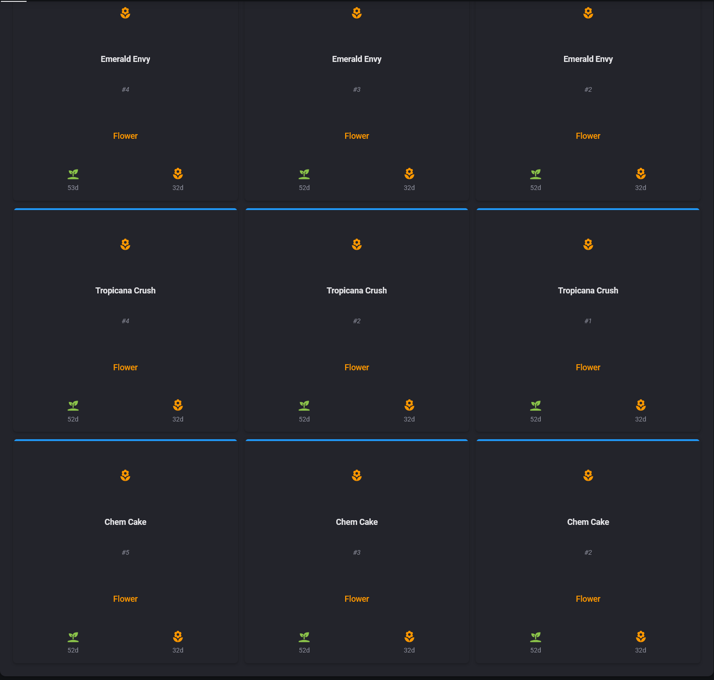

# Growspace Manager

[](https://github.com/hacs/integration)
[](https://developers.home-assistant.io/docs/integration-quality-scale/)
[](https://github.com/Venosta-web/growspace_manager/releases)
[](LICENSE)

**Growspace Manager** is a Home Assistant integration for indoor cultivators to track plants from seed to cure, automate climate and irrigation, and catch environmental problems before they damage your crop.


*Visual facility monitoring via the companion Lovelace card.*

---

## Core Features

- 🌱 **Detailed Plant Tracking**: Register and track individual plants through their lifecycle stages: `seedling → clone → mother → veg → flower → dry → cure`.
- 📐 **Visual Grid Layouts**: Arrange your plants in physical rows and columns inside logical growspaces.
- 💧 **Smart Irrigation & Crop Steering**: Configure vegetative or generative steering profiles (VWC targets, drybacks, shot frequencies) using substrate sensors.
- ❄️ **Adaptive VPD Control**: Automate dehumidification and HVAC devices to dynamically steer Vapor Pressure Deficit targets based on plant stage and day/night light cycles.
- 🧠 **Bayesian Environmental Analytics**: Probabilistically assess and report plant stress levels, mold risks, and schedule drift before physical symptoms appear.
- 🧬 **Genetics & Breeding Log**: Catalog strain lineages, parental crosses, seed inventories, and evaluate/score phenotypes to preserve keeper mother plants.
- 📦 **Post-Harvest Analytics**: Track daily weight decay curves and stem-moisture levels during drying to pinpoint optimal cure windows.
- 🖨️ **Niimbot Label Printing**: Connect directly via Bluetooth to print QR-coded plant tags containing strains, breeder logos, and genetic lineage.
- 💬 **Optional AI Grow Master**: Integrate standard Home Assistant Conversation Agents to inspect camera feeds (vision checkups) and chat with a context-aware Virtual Grow Master.

---

## Lovelace Dashboard Integration

To interact with your growspaces visually using drag-and-drop grids, batch plant actions, and live graphs, install the companion card:

* **Repository**: [Lovelace Growspace Manager Card](https://github.com/Venosta-web/lovelace-growspace-manager-card)
* **Basic Configuration**:
  ```yaml
  type: 'custom:growspace-manager-card'
  default_growspace: flower_tent
  ```

---

## Installation Walkthrough

### Step 1: Install frontend card via HACS
1. Go to **HACS** > **Frontend** in Home Assistant.
2. Click the three vertical dots in the top-right corner and select **Custom repositories**.
3. Add URL `https://github.com/Venosta-web/lovelace-growspace-manager-card` with category **Lovelace**.
4. Search for `Growspace Manager Card` and click **Download**.

### Step 2: Install integration via HACS
1. Go to **HACS** > **Integrations** in Home Assistant.
2. Click the three vertical dots in the top-right corner and select **Custom repositories**.
3. Add URL `https://github.com/Venosta-web/growspace_manager` with category **Integration**.
4. Search for `Growspace Manager` and click **Download**.
5. **Restart Home Assistant**.

---

## Step-by-Step Configuration Guide

1. **Initialize the Integration**: Go to **Settings** > **Devices & Services** > **+ Add Integration**, search for **Growspace Manager**, and install it.
2. **Define Your Growspaces**: Click **Configure** on the integration card, select **Manage Growspaces**, and choose **Add Growspace** (e.g., set up a 2x4 grid for "Flower Room").
3. **Configure Environment Sensors**: Bind your temperature, humidity, VPD, light, and circulation fan entities. Toggle **Control Dehumidifier** if you want target VPD-driven automation.
4. **Bind Irrigation Hardware**: Bind your feed pump and drainage switches under **Configure Irrigation** to enable timers and steering triggers.
5. **Configure AI (Optional)**: If you wish to use AI briefings and vision checkups, ensure you have set up a Home Assistant **Conversation Agent** (e.g., Google Generative AI or OpenAI) first. Then enable AI features in the integration configuration and bind it to that agent.

---

## Real-World Automation Examples

### 1. Toggle Automated Dehumidifier Steering
Turn on/off the integration's built-in target-VPD dehumidifier steering based on whether the growspace has active plants.

```yaml
alias: "Dehumidifier: Toggle Active Steering"
description: "Enable dehumidifier steering only when the growspace is active"
trigger:
  - platform: state
    entity_id: sensor.flower_tent_overview
action:
  - choose:
      # If plant count is greater than 0, enable steering
      - conditions:
          - condition: numeric_state
            entity_id: sensor.flower_tent_overview
            above: 0
        sequence:
          - service: growspace_manager.set_dehumidifier_control
            data:
              growspace_id: "flower_tent"
              enabled: true
      # If growspace is empty, turn off dehumidifier steering
      - conditions:
          - condition: numeric_state
            entity_id: sensor.flower_tent_overview
            below: 1
        sequence:
          - service: growspace_manager.set_dehumidifier_control
            data:
              growspace_id: "flower_tent"
              enabled: false
```

### 2. High Mold Risk Emergency Mitigation
Boosts air movement and ventilation when the Bayesian analysis flags high mold risk during dark cycles.

```yaml
alias: "IPM: High Mold Risk Mitigation"
trigger:
  - platform: state
    entity_id: binary_sensor.flower_tent_high_mold_risk
    to: "on"
action:
  - service: fan.turn_on
    target:
      entity_id: fan.tent_circulation
    data:
      percentage: 100
  - service: switch.turn_on
    target:
      entity_id: switch.tent_exhaust_boost
  - service: notify.mobile_app_iphone
    data:
      title: "⚠️ Mold Risk Alert: Flower Tent"
      message: "Dew point and humidity thresholds crossed during dark cycle. Exhaust and circulation fans boosted to 100%."
```

### 3. Harvest Cure-Ready Notification
Sends an alert to your phone when a drying plant's moisture decay curve reaches the cure-ready threshold (≤ 12%).

```yaml
alias: "Harvest: Plant Ready for Curing"
trigger:
  - platform: state
    entity_id: binary_sensor.gorilla_glue_4_drying_ready_for_cure
    to: "on"
action:
  - service: notify.mobile_app_iphone
    data:
      title: "🍯 Harvest Alert: Cure Ready!"
      message: "Gorilla Glue #4 stem moisture is under 12%. Ready to transfer from dry rack to curing jars."
```

---

## Service API & Developers Reference

All database, plant tracking, environmental setup, and scheduling operations are exposed as standard Home Assistant services.

For a complete description of all services, parameters, and example payloads, see the [Exhaustive Service API Reference](docs/services.md).

---

## Troubleshooting & Diagnostics

* **Bayesian environment sensors showing "Unavailable"**: Ensure you have successfully configured and bound valid Temperature, Humidity, and VPD sensors to the growspace environment. The Bayesian model also requires a brief warm-up period to pull initial sensor histories.
* **Niimbot printer fails to print**: Verify Bluetooth signal strength and range. Consider utilizing a Bluetooth proxy if the Home Assistant server is located away from the grow room.
* **Database errors after upgrades**: Run the `growspace_manager.debug_cleanup_legacy` service to purge orphaned data tables, and `growspace_manager.debug_reset_special_growspaces` to reconstruct overview zones.

---

## License

This project is licensed under the MIT License - see the [LICENSE](LICENSE) file for details.
